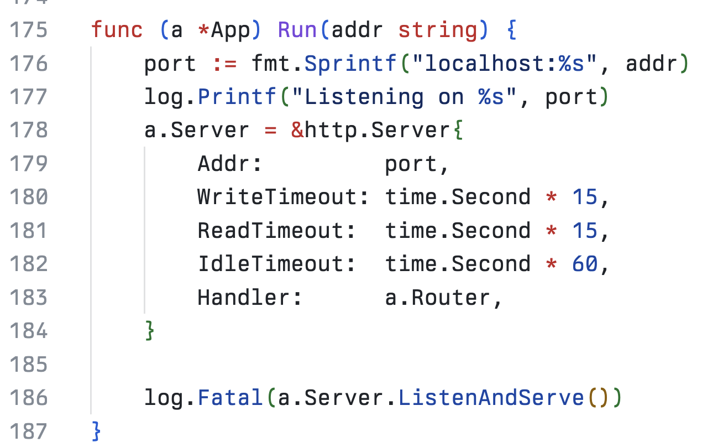

## Sponsoring open source

I just sponsored my first person using GitHub! https://github.com/sharkdp. Just a couple of USD ($) per month, but I hope those add up.
I'm a fan of David's [`bat`](https://github.com/sharkdp/bat) tool and have aliased `cat` to `bat`.  I also install the [`fd` tool](https://github.com/sharkdp/fd) as a sensible alternative to `find`.

Then I kept going and gave a tiny bit to [the](https://github.com/sponsors/andreynering) good [folks](https://github.com/sponsors/pd93) behind [Taskfile.dev](https://taskfile.dev/donate/) which is so nice as an alternative to `make` that I encourage everyone to take a look.

So, nothing big ($4 / month!) but my first step in the right direction.

## Berkeley Mono

My second 
I treated myself to a nice monospaced font for Christmas but I'm just sharing that news now: [Berkeley Mono](https://berkeleygraphics.com/typefaces/berkeley-mono/) looks just wonderful:

Really happy to support an excellent typeface, given that I'm a quiet lover of a good font. And  they just shipped their beta version of ligatures so now iTerms and my various other text interfaces look even nice.

I will update this personal website with the new look. Someday ;-)
